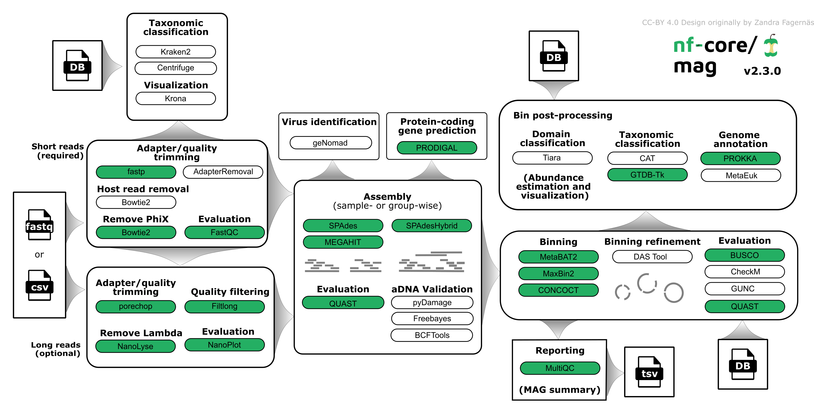

#  

[](https://github.com/nf-core/mag/actions?query=workflow%3A%22nf-core+CI%22)
[](https://github.com/nf-core/mag/actions?query=workflow%3A%22nf-core+linting%22)
[](https://nf-co.re/mag/results)
[](https://doi.org/10.5281/zenodo.3589527)
[](https://doi.org/10.1093/nargab/lqac007)

[](https://www.nextflow.io/)
[](https://docs.conda.io/en/latest/)
[](https://www.docker.com/)
[](https://sylabs.io/docs/)

[](https://nfcore.slack.com/channels/mag)
[](https://twitter.com/nf_core)
[](https://www.youtube.com/c/nf-core)

## Introduction

**nf-core/mag** is a bioinformatics best-practise analysis pipeline for assembly, binning and annotation of metagenomes.

<p align="center">
    
</p>

The pipeline is built using [Nextflow](https://www.nextflow.io), a workflow tool to run tasks across multiple compute infrastructures in a very portable manner. It uses Docker/Singularity containers making installation trivial and results highly reproducible. The [Nextflow DSL2](https://www.nextflow.io/docs/latest/dsl2.html) implementation of this pipeline uses one container per process which makes it much easier to maintain and update software dependencies. Where possible, these processes have been submitted to and installed from [nf-core/modules](https://github.com/nf-core/modules) in order to make them available to all nf-core pipelines, and to everyone within the Nextflow community!

On release, automated continuous integration tests run the pipeline on a full-sized dataset on the AWS cloud infrastructure. This ensures that the pipeline runs on AWS, has sensible resource allocation defaults set to run on real-world datasets, and permits the persistent storage of results to benchmark between pipeline releases and other analysis sources. The results obtained from the full-sized test can be viewed on the [nf-core website](https://nf-co.re/mag/results).

## Pipeline summary

By default, the pipeline currently performs the following: it supports both short and long reads, quality trims the reads and adapters with [fastp](https://github.com/OpenGene/fastp) and [Porechop](https://github.com/rrwick/Porechop), and performs basic QC with [FastQC](https://www.bioinformatics.babraham.ac.uk/projects/fastqc/).
The pipeline then:

- assigns taxonomy to reads using [Centrifuge](https://ccb.jhu.edu/software/centrifuge/) and/or [Kraken2](https://github.com/DerrickWood/kraken2/wiki)
- performs assembly using [MEGAHIT](https://github.com/voutcn/megahit) and [SPAdes](http://cab.spbu.ru/software/spades/), and checks their quality using [Quast](http://quast.sourceforge.net/quast)
- (optionally) performs ancient DNA assembly validation using [PyDamage](https://github.com/maxibor/pydamage) and contig consensus sequence recalling with [Freebayes](https://github.com/freebayes/freebayes) and [BCFtools](http://samtools.github.io/bcftools/bcftools.html)
- predicts protein-coding genes for the assemblies using [Prodigal](https://github.com/hyattpd/Prodigal)
- performs metagenome binning using [MetaBAT2](https://bitbucket.org/berkeleylab/metabat/src/master/) and/or with [MaxBin2](https://sourceforge.net/projects/maxbin2/), and checks the quality of the genome bins using [Busco](https://busco.ezlab.org/)
- optionally refines bins with [DAS_Tool](https://github.com/cmks/DAS_Tool)
- assigns taxonomy to bins using [GTDB-Tk](https://github.com/Ecogenomics/GTDBTk) and/or [CAT](https://github.com/dutilh/CAT)

Furthermore, the pipeline creates various reports in the results directory specified, including a [MultiQC](https://multiqc.info/) report summarizing some of the findings and software versions.

## Quick Start

1. Install [`Nextflow`](https://www.nextflow.io/docs/latest/getstarted.html#installation) (`>=21.10.3`)

2. Install any of [`Docker`](https://docs.docker.com/engine/installation/), [`Singularity`](https://www.sylabs.io/guides/3.0/user-guide/) (you can follow [this tutorial](https://singularity-tutorial.github.io/01-installation/)), [`Podman`](https://podman.io/), [`Shifter`](https://nersc.gitlab.io/development/shifter/how-to-use/) or [`Charliecloud`](https://hpc.github.io/charliecloud/) for full pipeline reproducibility _(you can use [`Conda`](https://conda.io/miniconda.html) both to install Nextflow itself and also to manage software within pipelines. Please only use it within pipelines as a last resort; see [docs](https://nf-co.re/usage/configuration#basic-configuration-profiles))_.

3. Download the pipeline and test it on a minimal dataset with a single command:

   ```console
   nextflow run nf-core/mag -profile test,YOURPROFILE --outdir <OUTDIR>
   ```

   Note that some form of configuration will be needed so that Nextflow knows how to fetch the required software. This is usually done in the form of a config profile (`YOURPROFILE` in the example command above). You can chain multiple config profiles in a comma-separated string.

   > - The pipeline comes with config profiles called `docker`, `singularity`, `podman`, `shifter`, `charliecloud` and `conda` which instruct the pipeline to use the named tool for software management. For example, `-profile test,docker`.
   > - Please check [nf-core/configs](https://github.com/nf-core/configs#documentation) to see if a custom config file to run nf-core pipelines already exists for your Institute. If so, you can simply use `-profile <institute>` in your command. This will enable either `docker` or `singularity` and set the appropriate execution settings for your local compute environment.
   > - If you are using `singularity`, please use the [`nf-core download`](https://nf-co.re/tools/#downloading-pipelines-for-offline-use) command to download images first, before running the pipeline. Setting the [`NXF_SINGULARITY_CACHEDIR` or `singularity.cacheDir`](https://www.nextflow.io/docs/latest/singularity.html?#singularity-docker-hub) Nextflow options enables you to store and re-use the images from a central location for future pipeline runs.
   > - If you are using `conda`, it is highly recommended to use the [`NXF_CONDA_CACHEDIR` or `conda.cacheDir`](https://www.nextflow.io/docs/latest/conda.html) settings to store the environments in a central location for future pipeline runs.

4. Start running your own analysis!

   ```console
   nextflow run nf-core/mag -profile <docker/singularity/podman/shifter/charliecloud/conda/institute> --input '*_R{1,2}.fastq.gz' --outdir <OUTDIR>
   ```

   or

   ```console
   nextflow run nf-core/mag -profile <docker/singularity/podman/shifter/charliecloud/conda/institute> --input samplesheet.csv --outdir <OUTDIR>
   ```

See [usage docs](https://nf-co.re/mag/usage) and [parameter docs](https://nf-co.re/mag/parameters) for all of the available options when running the pipeline.

## Documentation

The nf-core/mag pipeline comes with documentation about the pipeline [usage](https://nf-co.re/mag/usage), [parameters](https://nf-co.re/mag/parameters) and [output](https://nf-co.re/mag/output). Detailed information about how to specify the input can be found under [input specifications](https://nf-co.re/mag/usage#input_specifications).

### Group-wise co-assembly and co-abundance computation

Each sample has an associated group ID (see [input specifications](https://nf-co.re/mag/usage#input_specifications)). This group information can be used for group-wise co-assembly with `MEGAHIT` or `SPAdes` and/or to compute co-abundances for the binning step with `MetaBAT2`. By default, group-wise co-assembly is disabled, while the computation of group-wise co-abundances is enabled. For more information about how this group information can be used see the documentation for the parameters [`--coassemble_group`](https://nf-co.re/mag/parameters#coassemble_group) and [`--binning_map_mode`](https://nf-co.re/mag/parameters#binning_map_mode).

When group-wise co-assembly is enabled, `SPAdes` is run on accordingly pooled read files, since `metaSPAdes` does not yet allow the input of multiple samples or libraries. In contrast, `MEGAHIT` is run for each group while supplying lists of the individual readfiles.

## Credits

nf-core/mag was written by [Hadrien Gourlé](https://hadriengourle.com) at [SLU](https://slu.se), [Daniel Straub](https://github.com/d4straub) and [Sabrina Krakau](https://github.com/skrakau) at the [Quantitative Biology Center (QBiC)](http://qbic.life).

Long read processing was inspired by [caspargross/HybridAssembly](https://github.com/caspargross/HybridAssembly) written by Caspar Gross [@caspargross](https://github.com/caspargross)

We thank the following people for their extensive assistance in the development of this pipeline:

- [Alexander Peltzer](https://github.com/apeltzer)
- [Antonia Schuster](https://github.com/antoniaschuster)
- [Phil Ewels](https://github.com/ewels)
- [Gisela Gabernet](https://github.com/ggabernet)
- [Harshil Patel](https://github.com/drpatelh)
- [Johannes Alneberg](https://github.com/alneberg)
- [Maxime Borry](https://github.com/maxibor)
- [Maxime Garcia](https://github.com/MaxUlysse)
- [Michael L Heuer](https://github.com/heuermh)

## Contributions and Support

If you would like to contribute to this pipeline, please see the [contributing guidelines](.github/CONTRIBUTING.md).

For further information or help, don't hesitate to get in touch on the [Slack `#mag` channel](https://nfcore.slack.com/channels/mag) (you can join with [this invite](https://nf-co.re/join/slack)).

## Citations

If you use nf-core/mag for your analysis, please cite the preprint as follows:

> **nf-core/mag: a best-practice pipeline for metagenome hybrid assembly and binning**
>
> Sabrina Krakau, Daniel Straub, Hadrien Gourlé, Gisela Gabernet, Sven Nahnsen.
>
> NAR Genom Bioinform. 2022 Feb 2;4(1):lqac007. doi: [10.1093/nargab/lqac007](https://doi.org/10.1093/nargab/lqac007).

additionally you can cite the pipeline directly with the following doi: [10.5281/zenodo.3589527](https://doi.org/10.5281/zenodo.3589527)

An extensive list of references for the tools used by the pipeline can be found in the [`CITATIONS.md`](CITATIONS.md) file.

You can cite the `nf-core` publication as follows:

> **The nf-core framework for community-curated bioinformatics pipelines.**
>
> Philip Ewels, Alexander Peltzer, Sven Fillinger, Harshil Patel, Johannes Alneberg, Andreas Wilm, Maxime Ulysse Garcia, Paolo Di Tommaso & Sven Nahnsen.
>
> _Nat Biotechnol._ 2020 Feb 13. doi: [10.1038/s41587-020-0439-x](https://dx.doi.org/10.1038/s41587-020-0439-x).
