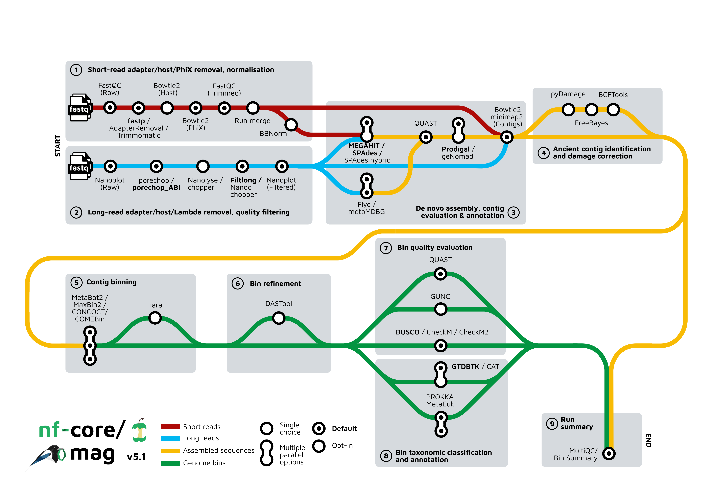

<h1>
  <picture>
    <source media="(prefers-color-scheme: dark)" srcset="docs/images/mag_logo_mascot_dark.png">
    
  </picture>
</h1>

[](https://github.com/codespaces/new/nf-core/mag)
[](https://github.com/nf-core/mag/actions/workflows/nf-test.yml)
[](https://github.com/nf-core/mag/actions/workflows/linting.yml)[](https://nf-co.re/mag/results)[](https://doi.org/10.5281/zenodo.3589527)
[](https://www.nf-test.com)
[](https://doi.org/10.1093/nargab/lqac007)

[](https://www.nextflow.io/)
[](https://github.com/nf-core/tools/releases/tag/3.4.1)
[](https://docs.conda.io/en/latest/)
[](https://www.docker.com/)
[](https://sylabs.io/docs/)
[](https://cloud.seqera.io/launch?pipeline=https://github.com/nf-core/mag)

[](https://nfcore.slack.com/channels/mag)[](https://bsky.app/profile/nf-co.re)[](https://mstdn.science/@nf_core)[](https://www.youtube.com/c/nf-core)


## Introduction

**nf-core/mag** is a bioinformatics best-practise analysis pipeline for assembly, binning and annotation of metagenomes.

<p>
  <picture>
    <source media="(prefers-color-scheme: dark)" srcset="docs/images/mag_metromap_dark.png">
    
  </picture>
</p>

## Pipeline summary

## Usage

> [!NOTE]
> If you are new to Nextflow and nf-core, please refer to [this page](https://nf-co.re/docs/usage/installation) on how to set-up Nextflow. Make sure to [test your setup](https://nf-co.re/docs/usage/introduction#how-to-run-a-pipeline) with `-profile test` before running the workflow on actual data.

By default, the pipeline currently performs the following: it supports both short and long reads, quality trims the reads and adapters with [fastp](https://github.com/OpenGene/fastp), [AdapterRemoval](https://github.com/MikkelSchubert/adapterremoval), or [trimmomatic](https://github.com/usadellab/Trimmomatic) and [Porechop](https://github.com/rrwick/Porechop), and performs basic QC with [FastQC](https://www.bioinformatics.babraham.ac.uk/projects/fastqc/), and merges multiple sequencing runs.

The pipeline then:

- performs assembly using [MEGAHIT](https://github.com/voutcn/megahit) and [SPAdes](http://cab.spbu.ru/software/spades/), and checks their quality using [Quast](http://quast.sourceforge.net/quast)
- (optionally) performs ancient DNA assembly validation using [PyDamage](https://github.com/maxibor/pydamage) and contig consensus sequence recalling with [Freebayes](https://github.com/freebayes/freebayes) and [BCFtools](http://samtools.github.io/bcftools/bcftools.html)
- predicts protein-coding genes for the assemblies using [Prodigal](https://github.com/hyattpd/Prodigal), and bins with [Prokka](https://github.com/tseemann/prokka) and optionally [MetaEuk](https://www.google.com/search?channel=fs&client=ubuntu-sn&q=MetaEuk)
- performs metagenome binning using [MetaBAT2](https://bitbucket.org/berkeleylab/metabat/src/master/), [MaxBin2](https://sourceforge.net/projects/maxbin2/), [CONCOCT](https://github.com/BinPro/CONCOCT), and/or [COMEBin](https://github.com/ziyewang/COMEBin)
- checks the quality of the genome bins using [Busco](https://busco.ezlab.org/), [CheckM](https://ecogenomics.github.io/CheckM/), or [CheckM2](https://github.com/chklovski/CheckM2) and optionally [GUNC](https://grp-bork.embl-community.io/gunc/)
- Performs ancient DNA validation and repair with [pyDamage](https://github.com/maxibor/pydamage) and [freebayes](https://github.com/freebayes/freebayes)
- optionally refines bins with [DAS Tool](https://github.com/cmks/DAS_Tool)
- assigns taxonomy to bins using [GTDB-Tk](https://github.com/Ecogenomics/GTDBTk) and/or [CAT](https://github.com/dutilh/CAT) and optionally identifies viruses in assemblies using [geNomad](https://github.com/apcamargo/genomad), or Eukaryotes with [Tiara](https://github.com/ibe-uw/tiara)

Furthermore, the pipeline creates various reports in the results directory specified, including a [MultiQC](https://multiqc.info/) report summarizing some of the findings and software versions.

## Usage

> [!NOTE]
> If you are new to Nextflow and nf-core, please refer to [this page](https://nf-co.re/docs/usage/installation) on how to set-up Nextflow. Make sure to [test your setup](https://nf-co.re/docs/usage/introduction#how-to-run-a-pipeline) with `-profile test` before running the workflow on actual data.

```bash
nextflow run nf-core/mag -profile <docker/singularity/podman/shifter/charliecloud/conda/institute> --input samplesheet.csv --outdir <OUTDIR>
```

> [!WARNING]
> Please provide pipeline parameters via the CLI or Nextflow `-params-file` option. Custom config files including those provided by the `-c` Nextflow option can be used to provide any configuration _**except for parameters**_; see [docs](https://nf-co.re/docs/usage/getting_started/configuration#custom-configuration-files).

For more details and further functionality, please refer to the [usage documentation](https://nf-co.re/mag/usage) and the [parameter documentation](https://nf-co.re/mag/parameters).

## Pipeline output

To see the results of an example test run with a full size dataset refer to the [results](https://nf-co.re/mag/results) tab on the nf-core website pipeline page.
For more details about the output files and reports, please refer to the
[output documentation](https://nf-co.re/mag/output).

### Group-wise co-assembly and co-abundance computation

Each sample has an associated group ID (see [input specifications](https://nf-co.re/mag/usage#input_specifications)). This group information can be used for group-wise co-assembly with `MEGAHIT` or `SPAdes` and/or to compute co-abundances for the binning step with `MetaBAT2`. By default, group-wise co-assembly is disabled, while the computation of group-wise co-abundances is enabled. For more information about how this group information can be used see the documentation for the parameters [`--coassemble_group`](https://nf-co.re/mag/parameters#coassemble_group) and [`--binning_map_mode`](https://nf-co.re/mag/parameters#binning_map_mode).

When group-wise co-assembly is enabled, `SPAdes` is run on accordingly pooled read files, since `metaSPAdes` does not yet allow the input of multiple samples or libraries. In contrast, `MEGAHIT` is run for each group while supplying lists of the individual readfiles.

## Credits

nf-core/mag was written by [Hadrien Gourlé](https://hadriengourle.com) at [SLU](https://slu.se), [Daniel Straub](https://github.com/d4straub) and [Sabrina Krakau](https://github.com/skrakau) at the [Quantitative Biology Center (QBiC)](http://qbic.life). [James A. Fellows Yates](https://github.com/jfy133) and [Maxime Borry](https://github.com/maxibor) at the [Max Planck Institute for Evolutionary Anthropology](https://www.eva.mpg.de) joined in version 2.2.0.

Other code contributors include:

- [Antonia Schuster](https://github.com/AntoniaSchuster)
- [Alexander Ramos](https://github.com/alxndrdiaz)
- [Carson Miller](https://github.com/CarsonJM)
- [Daniel Lundin](https://github.com/erikrikarddaniel)
- [Danielle Callan](https://github.com/d-callan)
- [Gregory Sprenger](https://github.com/gregorysprenger)
- [Jim Downie](https://github.com/prototaxites)
- [Phil Palmer](https://github.com/PhilPalmer)
- [William Rosenbaum](https://github.com/willros)
- [Adam Rosenbaum](https://github.com/muabnezor)
- [Diego Alvarez](https://github.com/dialvarezs)
- [Nikolaos Vergoulidis](https://github.com/IceGreb)
- [Greg Fedewa](https://github.com/harper357)
- [Vini Salazar](https://github.com/vinisalazar)
- [Alex Caswell](https://github.com/AlexHoratio)

Long read processing was inspired by [caspargross/HybridAssembly](https://github.com/caspargross/HybridAssembly) written by Caspar Gross [@caspargross](https://github.com/caspargross)

We thank the following people for their extensive assistance in the development of this pipeline:

- [Alexander Peltzer](https://github.com/apeltzer)
- [Phil Ewels](https://github.com/ewels)
- [Gisela Gabernet](https://github.com/ggabernet)
- [Harshil Patel](https://github.com/drpatelh)
- [Johannes Alneberg](https://github.com/alneberg)
- [Maxime Garcia](https://github.com/MaxUlysse)
- [Michael L Heuer](https://github.com/heuermh)
- [Alex Hübner](https://github.com/alexhbnr)

## Contributions and Support

If you would like to contribute to this pipeline, please see the [contributing guidelines](.github/CONTRIBUTING.md).

For further information or help, don't hesitate to get in touch on the [Slack `#mag` channel](https://nfcore.slack.com/channels/mag) (you can join with [this invite](https://nf-co.re/join/slack)).

## Citations

If you use nf-core/mag for your analysis, please cite the preprint as follows:

> **nf-core/mag: a best-practice pipeline for metagenome hybrid assembly and binning**
>
> Sabrina Krakau, Daniel Straub, Hadrien Gourlé, Gisela Gabernet, Sven Nahnsen.
>
> NAR Genom Bioinform. 2022 Feb 2;4(1):lqac007. doi: [10.1093/nargab/lqac007](https://doi.org/10.1093/nargab/lqac007).

Additionally you can cite the pipeline directly with the following doi: [10.5281/zenodo.3589527](https://doi.org/10.5281/zenodo.3589527)

An extensive list of references for the tools used by the pipeline can be found in the [`CITATIONS.md`](CITATIONS.md) file.

You can cite the `nf-core` publication as follows:

> **The nf-core framework for community-curated bioinformatics pipelines.**
>
> Philip Ewels, Alexander Peltzer, Sven Fillinger, Harshil Patel, Johannes Alneberg, Andreas Wilm, Maxime Ulysse Garcia, Paolo Di Tommaso & Sven Nahnsen.
>
> _Nat Biotechnol._ 2020 Feb 13. doi: [10.1038/s41587-020-0439-x](https://dx.doi.org/10.1038/s41587-020-0439-x).
