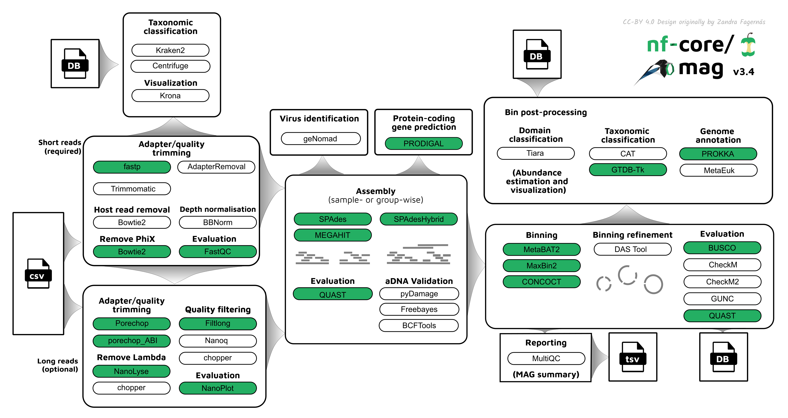

# 

**Assembly, binning and annotation of metagenomes**.

[](https://github.com/nf-core/mag/actions)
[](https://github.com/nf-core/mag/actions)
[](https://www.nextflow.io/)

[](https://bioconda.github.io/)
[](https://hub.docker.com/r/nfcore/mag)
[](https://doi.org/10.5281/zenodo.3589527)
[](https://nfcore.slack.com/channels/mag)

## Introduction

This pipeline is for assembly, binning, and annotation of metagenomes.

<p align="center">
    

The pipeline is built using [Nextflow](https://www.nextflow.io), a workflow tool to run tasks across multiple compute infrastructures in a very portable manner. It comes with docker containers making installation trivial and results highly reproducible.

## Quick Start

1. Install [`nextflow`](https://nf-co.re/usage/installation)

2. Install any of [`Docker`](https://docs.docker.com/engine/installation/), [`Singularity`](https://www.sylabs.io/guides/3.0/user-guide/) or [`Podman`](https://podman.io/) for full pipeline reproducibility _(please only use [`Conda`](https://conda.io/miniconda.html) as a last resort; see [docs](https://nf-co.re/usage/configuration#basic-configuration-profiles))_

3. Download the pipeline and test it on a minimal dataset with a single command:

    ```bash
    nextflow run nf-core/mag -profile test,<docker/singularity/podman/conda/institute>
    ```

    > Please check [nf-core/configs](https://github.com/nf-core/configs#documentation) to see if a custom config file to run nf-core pipelines already exists for your Institute. If so, you can simply use `-profile <institute>` in your command. This will enable either `docker` or `singularity` and set the appropriate execution settings for your local compute environment.

4. Start running your own analysis!

    ```bash
    nextflow run nf-core/mag -profile <docker/singularity/podman/conda/institute> --input '*_R{1,2}.fastq.gz'
    ```

See [usage docs](https://nf-co.re/mag/usage) for all of the available options when running the pipeline.

## Documentation

The nf-core/mag pipeline comes with documentation about the pipeline: [usage](https://nf-co.re/mag/usage) and [output](https://nf-co.re/mag/output).

In short, it supports both short and long reads, quality trims the reads and adapters with [fastp](https://github.com/OpenGene/fastp) and [porechop](https://github.com/rrwick/Porechop), and performs basic QC with [fastqc](https://www.bioinformatics.babraham.ac.uk/projects/fastqc/).
The pipeline then:

* assigns taxonomy to reads using [centrifuge](https://ccb.jhu.edu/software/centrifuge/) and/or [kraken2](https://github.com/DerrickWood/kraken2/wiki)
* performs assembly using [megahit](https://github.com/voutcn/megahit) and [spades](http://cab.spbu.ru/software/spades/), and checks their quality using [quast](http://quast.sourceforge.net/quast)
* performs metagenome binning using [metabat2](https://bitbucket.org/berkeleylab/metabat/src/master/), and checks the quality of the genome bins using [busco](https://busco.ezlab.org/)
* assigns taxonomy to the assembled contigs and to bins using [CAT](https://github.com/dutilh/CAT)

Furthermore, the pipeline creates various reports in the results directory specified, including a [multiqc](https://multiqc.info/) report summarizing some of the findings and software versions.

## Credits

nf-core/mag was written by [Hadrien Gourlé](https://hadriengourle.com) at [SLU](https://slu.se), [Daniel Straub](https://github.com/d4straub) and [Sabrina Krakau](https://github.com/skrakau) at the [Quantitative Biology Center (QBiC)](http://qbic.life).

Long read processing was inspired by [caspargross/HybridAssembly](https://github.com/caspargross/HybridAssembly) written by Caspar Gross [@caspargross](https://github.com/caspargross)

Many thanks to the additional contributors who have helped out and/or provided suggestions:

* [Alexander Peltzer](https://github.com/apeltzer)
* [Phil Ewels](https://github.com/ewels)
* [Gisela Gabernet](https://github.com/ggabernet)
* [Harshil Patel](https://github.com/drpatelh)
* [Johannes Alneberg](https://github.com/alneberg)
* [Maxime Borry](https://github.com/maxibor)
* [Maxime Garcia](https://github.com/MaxUlysse)
* [Michael L Heuer](https://github.com/heuermh)

## Contributions and Support

If you would like to contribute to this pipeline, please see the [contributing guidelines](.github/CONTRIBUTING.md).

For further information or help, don't hesitate to get in touch on the [Slack `#mag` channel](https://nfcore.slack.com/channels/mag) (you can join with [this invite](https://nf-co.re/join/slack)).

## Citation

If you use nf-core/mag for your analysis, please cite it using the following doi: [10.5281/zenodo.3589527](https://doi.org/10.5281/zenodo.3589527)

You can cite the `nf-core` publication as follows:

> **The nf-core framework for community-curated bioinformatics pipelines.**
>
> Philip Ewels, Alexander Peltzer, Sven Fillinger, Harshil Patel, Johannes Alneberg, Andreas Wilm, Maxime Ulysse Garcia, Paolo Di Tommaso & Sven Nahnsen.
>
> _Nat Biotechnol._ 2020 Feb 13. doi: [10.1038/s41587-020-0439-x](https://dx.doi.org/10.1038/s41587-020-0439-x).
> ReadCube: [Full Access Link](https://rdcu.be/b1GjZ)
